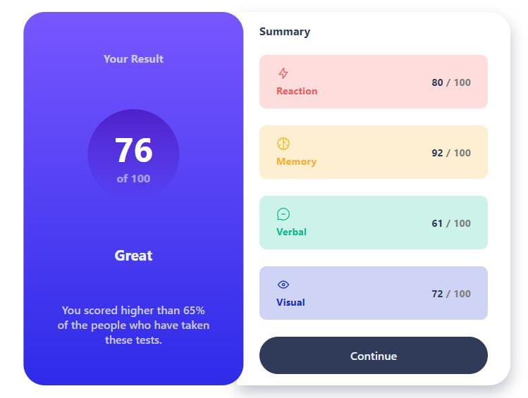

# Frontend Mentor - Results summary component solution

This is a solution to the [Results summary component challenge on Frontend Mentor](https://www.frontendmentor.io/challenges/results-summary-component-CE_K6s0maV). Frontend Mentor challenges help you improve your coding skills by building realistic projects. 

## Table of contents

- [Overview](#overview)
  - [The challenge](#the-challenge)
  - [Screenshot](#screenshot)
  - [Links](#links)
- [My process](#my-process)
  - [Built with](#built-with)
  - [What I learned](#what-i-learned)
  - [Continued development](#continued-development)
  - [Useful resources](#useful-resources)
- [Author](#author)

## Overview

### The challenge

Users should be able to:

- View the optimal layout for the interface depending on their device's screen size
- See hover and focus states for all interactive elements on the page

### Screenshot

### Links

- Solution URL: [Add solution URL here](https://your-solution-url.com)
- Live Site URL: [Add live site URL here](https://your-live-site-url.com)

## My process

### Built with

- Semantic HTML5 markup
- CSS custom properties
- Flexbox
- Mobile-first workflow

### What I learned

Doing this challenge helped me to acquire more knowledge about flexbox. I got stuck in some parts, but in the end everything worked.

### Continued development

In my future projects I want to learn more about media queries and CSS in general, I am struggling a bit with these.

### Useful resources

- [Adrian Gallano github](https://github.com/AdrianGallano/results-summary-component) - This helped me when i got stuck. Thanks Adrian.
- [Flexbox guide](https://css-tricks.com/snippets/css/a-guide-to-flexbox/) - This is an amazing article which helped me understand flexbox. I'd recommend it to anyone still learning this concept.

## Author

- Github - [Rafael Ribeiro](https://github.com/RafaelRi23)
- Frontend Mentor - [@RafaelRi23](https://www.frontendmentor.io/profile/RafaelRi23)

